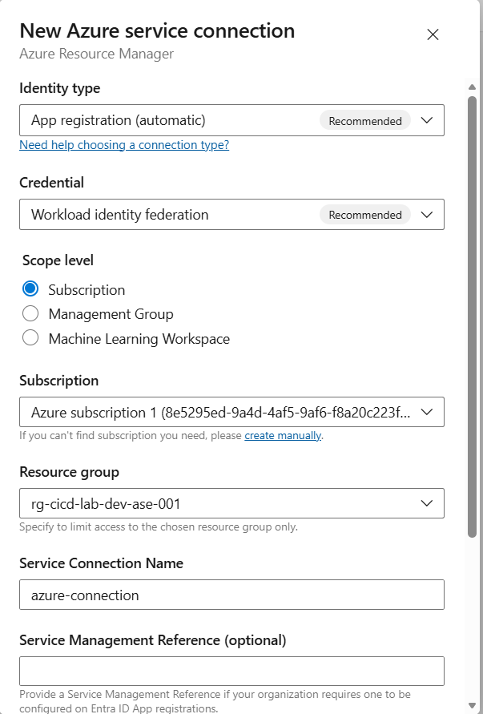
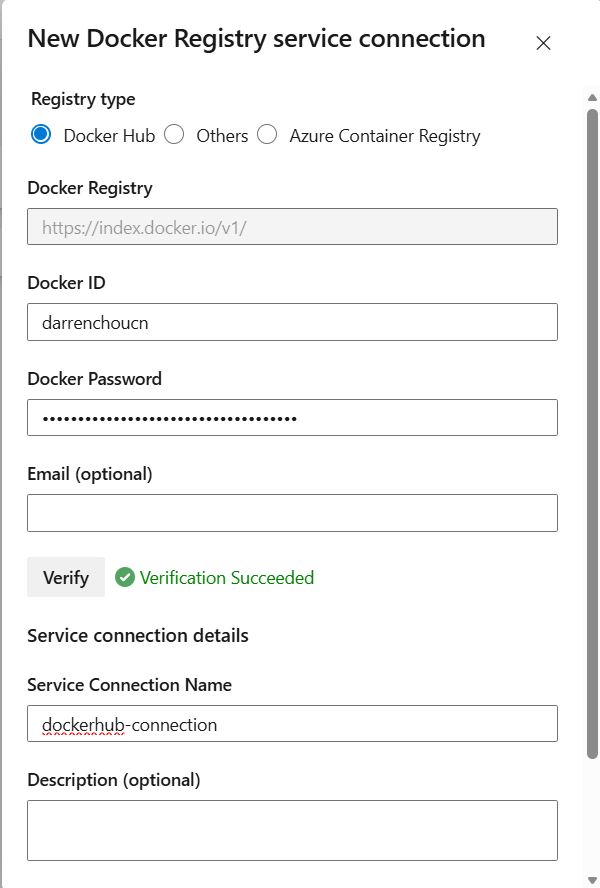
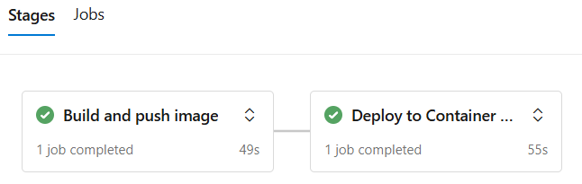
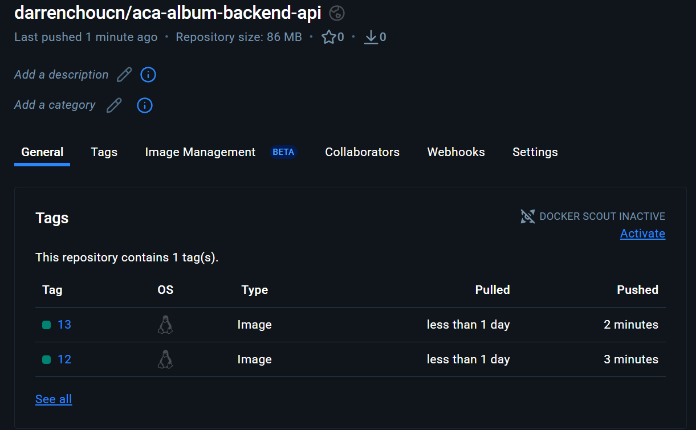
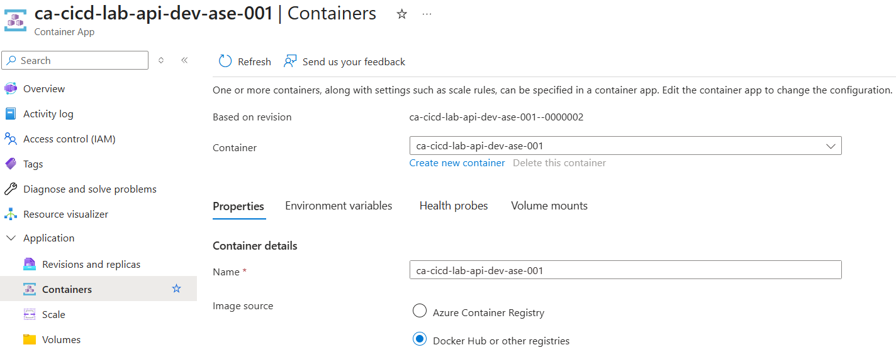

## Creating a CI/CD pipeline for Azure Container Apps

#### 1. Variable

```bash
RESOURCE_GROUP="rg-cicd-lab-dev-ase-001"
LOCATION="australiasoutheast"
CONTAINERAPPS_ENVIRONMENT="acae-cicd-lab-dev-ase-001"
CONTAINERAPPS_APP="ca-cicd-lab-api-dev-ase-001"

az group create \
  --name "$RESOURCE_GROUP" \
  --location "$LOCATION"
```

#### 2. Create a Container Apps

```bash
az containerapp env create \
  --name "$CONTAINERAPPS_ENVIRONMENT" \
  --resource-group "$RESOURCE_GROUP" \
  --location "$LOCATION"

az containerapp create \
  --name "$CONTAINERAPPS_APP" \
  --resource-group "$RESOURCE_GROUP" \
  --environment "$CONTAINERAPPS_ENVIRONMENT" \
  --image mcr.microsoft.com/azuredocs/containerapps-helloworld:latest \
  --target-port 80 \
  --ingress external
```

#### 3. Create Azure Service Principal for Pipelines (deprecated)

```bash
RESOURCE_GROUP="rg-cicd-lab-dev-ase-001"

RESOURCE_GROUP_ID=$(az group show --name "$RESOURCE_GROUP" --query id -o tsv)
echo "$RESOURCE_GROUP_ID"

SPN_NAME="spn-cicd-lab-aca-dev-ase-001"

az ad sp create-for-rbac \
  --name "$SPN_NAME" \
  --role "Contributor" \
  --scopes "$RESOURCE_GROUP_ID" \
  --sdk-auth > spn-aca-ado.json

echo "Saved credentials to: spn-aca-ado.json"
```

#### 4. Create Service Connection

_ADO -> Your Project -> Project Settings -> Pipelines -> Service connections -> Create service connection_

**Azure Connection**



**Docker Hub Connection**



#### 5. Configure Pipelines

```yaml
trigger:
  - main

resources:
  - repo: self

variables:
  IMAGE_NAME: "darrenchoucn/aca-album-backend-api"
  CONTAINERAPPS_APP: "ca-cicd-lab-api-dev-ase-001"
  CONTAINERAPPS_ENVIRONMENT: "acae-cicd-lab-dev-ase-001"
  RESOURCE_GROUP: "rg-cicd-lab-dev-ase-001"
  TAG: "$(Build.BuildId)"

stages:
  - stage: Build
    displayName: Build and push image
    jobs:
      - job: Build
        displayName: Build
        pool:
          vmImage: ubuntu-latest
        steps:
          - script: |
              echo "Sources dir: $(Build.SourcesDirectory)"
              ls -la $(Build.SourcesDirectory)
              echo "Find Dockerfile:"
              find $(Build.SourcesDirectory) -maxdepth 6 -type f -iname "dockerfile" -print
            displayName: "Debug: locate Dockerfile"

          - task: Docker@2
            displayName: Build and push image to Docker Hub
            inputs:
              containerRegistry: "docker-hub-connection"
              command: "buildAndPush"
              dockerfile: "$(Build.SourcesDirectory)/azure/backend_api/backend_api_csharp/Dockerfile"
              repository: "$(IMAGE_NAME)"
              tags: |
                $(TAG)

  - stage: Deploy
    displayName: Deploy to Container Apps
    dependsOn: Build
    jobs:
      - job: Deploy
        displayName: Deploy
        pool:
          vmImage: ubuntu-latest
        steps:
          - task: AzureContainerApps@1
            displayName: Deploy new container version
            inputs:
              azureSubscription: "azure-connection"
              imageToDeploy: "$(IMAGE_NAME):$(TAG)"
              containerAppName: "$(CONTAINERAPPS_APP)"
              resourceGroup: "$(RESOURCE_GROUP)"
              containerAppEnvironment: "$(CONTAINERAPPS_ENVIRONMENT)"
              targetPort: "3500"
              ingress: "external"
```

#### 6. Confirm Results

**Pipeline**


**Docker Hub**


**Container App**

