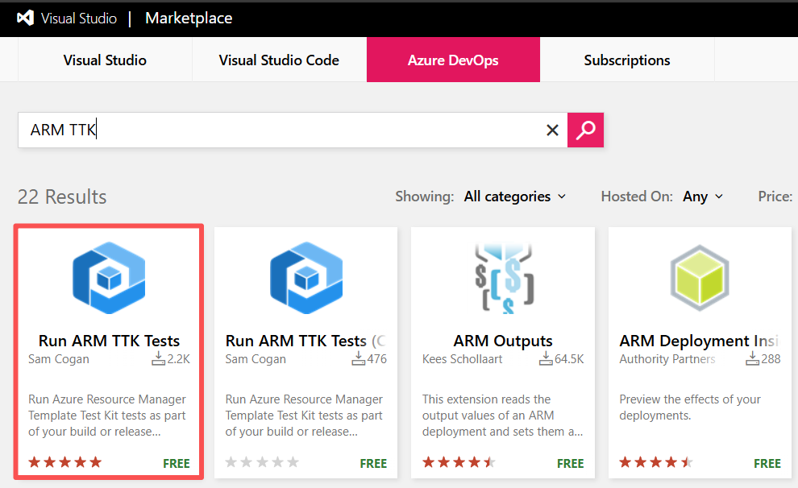
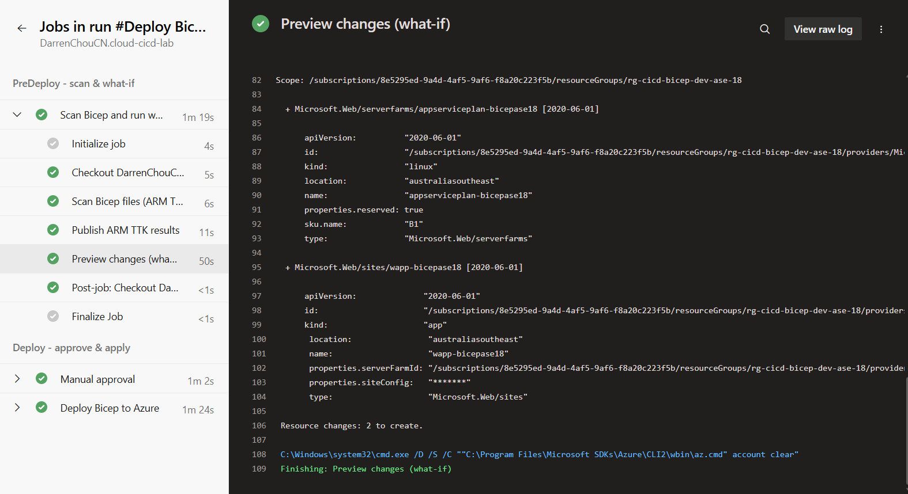
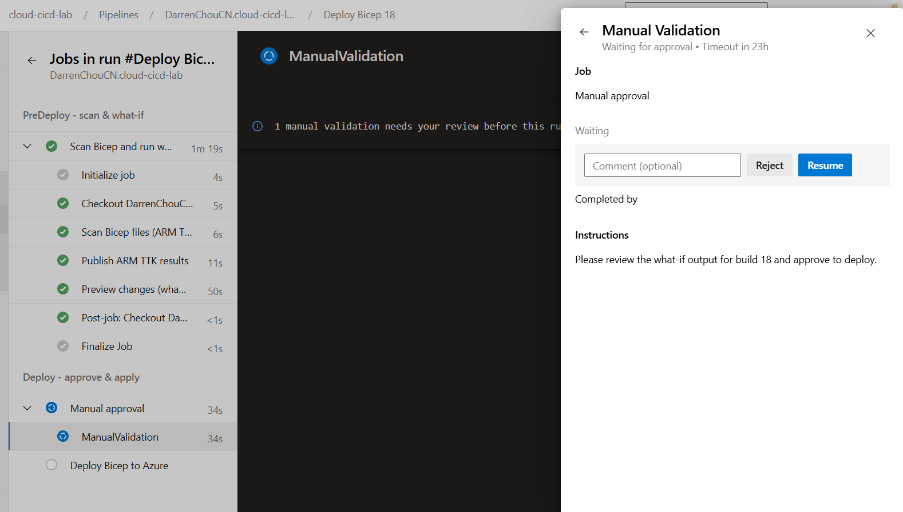
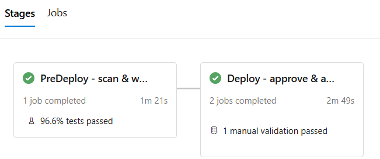
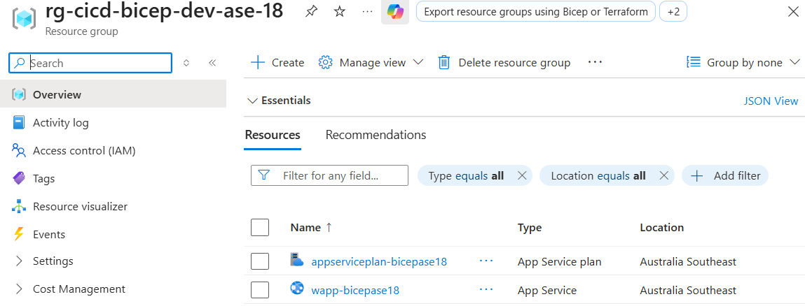

## Creating a CI/CD pipeline for Bicep

#### 1. Install TTK Tests

_Organization Settings -> Extensions -> Browse marketplace_

#### 2. Configure Pipelines

**See** [`bicep-pipelines.yaml`](./pipelines/bicep-pipelines.yaml)

#### 3. Preview Changes

#### 4. Manual Validation

#### 5. Successfully Deploy Bicep template

