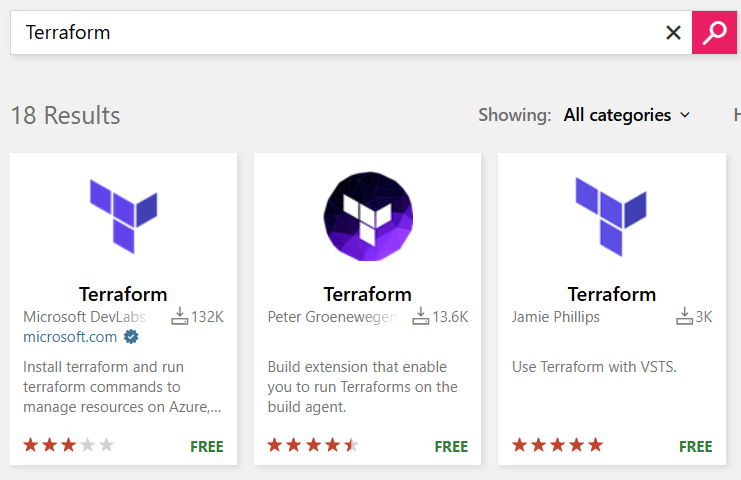

## Creating a CI/CD pipeline for Terraform

#### 1. Create Bootstrap Backend Storage Account

**See** [`bootstrap-tf-backend.sh`](./pipelines/bootstrap-tf-backend.sh)

#### 2. Install Terraform Extension



#### 3. Assign Storage Blob Data Contributor role for Service Connection

_Project Settings -> Service connections -> Manage App registration -> Copy "Application (client) ID"_

**Open Azure CLI**

```bash
APP_ID="PASTE YOUR APP_ID"

SP_OBJECT_ID="$(az ad sp show --id "$APP_ID" --query id -o tsv)"
echo "SP_OBJECT_ID=$SP_OBJECT_ID"

SUB_ID="$(az account show --query id -o tsv)"

TFSTATE_RG="rg-iac-tfstate-dev"
TFSTATE_ACCOUNT="stiacdevtfstate001"
TFSTATE_CONTAINER="tfstate"

SCOPE="/subscriptions/$SUB_ID/resourceGroups/$TFSTATE_RG/providers/Microsoft.Storage/storageAccounts/$TFSTATE_ACCOUNT/blobServices/default/containers/$TFSTATE_CONTAINER"

az role assignment create \
  --assignee-object-id "$SP_OBJECT_ID" \
  --assignee-principal-type ServicePrincipal \
  --role "Storage Blob Data Contributor" \
  --scope "$SCOPE"
```

#### 4. Configure Pipelines

**See** [`terraform-pipelines.yml`](./pipelines/terraform-pipelines.yml)
